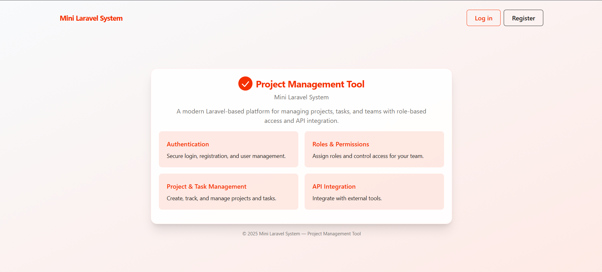
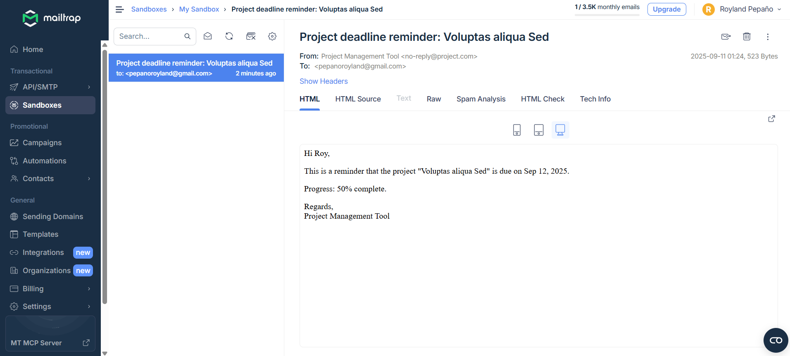

# Project Management Tool (Mini Laravel System)



This repository contains a small project management application built on Laravel. The app supports user authentication, roles (admin/user), projects and tasks, an API protected with Sanctum, activity logging, task assignment, and deadline reminders.

## Quick facts

-   Laravel: 12.x
-   PHP: 8.2+
-   Database: MySQL

## Getting started (local)

Follow these steps to get the project running locally (Windows / bash):

1. Install PHP, Composer, Node.js and a database (MySQL).

2. From the project root run:

```bash
composer install
cp .env.example .env
```

3. Edit `.env` and set your database credentials (DB_CONNECTION=mysql, DB_HOST, DB_DATABASE, DB_USERNAME, DB_PASSWORD)`.

4. Generate app key, run migrations and seed:

```bash
php artisan key:generate
php artisan migrate
php artisan db:seed --class=DatabaseSeeder
```

5. Install frontend deps and build assets:

```bash
npm install
```

6. Serve the app:

```bash
composer run dev
```

## Test accounts / credentials

There are no pre-seeded users by default. Create test accounts using tinker or a seeder. Example commands to create an admin and a user:

```bash
php artisan tinker
>>> \App\Models\User::create(['name' => 'Admin User', 'email' => 'admin@example.com', 'password' => bcrypt('password'), 'role' => 'admin']);
>>> \App\Models\User::create(['name' => 'Normal User', 'email' => 'user@example.com', 'password' => bcrypt('password'), 'role' => 'user']);
```

Credentials to test with (after creation above):

-   Admin: admin@example.com / password
-   User: user@example.com / password

## Running tests

Run:

```bash
php artisan test
```

## API

-   API routes are under `routes/api.php` and are protected with Laravel Sanctum (`auth:sanctum`).
-   Resources: `App\\Http\\Resources\\ProjectResource`, `App\\Http\\Resources\\TaskResource`.

How to get a token (example using personal access tokens):

1. Ensure `laravel/sanctum` is installed and migrations published:

```bash
php artisan vendor:publish --tag=sanctum-migrations
php artisan migrate
```

2. Create token via tinker (example):

```bash
php artisan tinker
>>> $u = \\App\\Models\\User::where('email','admin@example.com')->first();
>>> $u->createToken('api-token')->plainTextToken;
```

Then include the token in `Authorization: Bearer <token>` for API requests.

## Notable features / architecture

-   Authentication: views and controllers located under `app/Http/Controllers/Auth/*` and routes in `routes/auth.php`.
-   Roles: `role` column on `users` table; enforced via `AdminMiddleware` (`app/Http/Middleware/AdminMiddleware.php`) and policy checks (`app/Policies/*`).
-   Projects: `app/Models/Project.php` (soft deletes, `tasks()` relationship, `progress` accessor). CRUD in `app/Http/Controllers/ProjectController.php` with form requests `StoreProjectRequest`/`UpdateProjectRequest`.
-   Tasks: `app/Models/Task.php` with `assigned_to`, `app/Http/Controllers/TaskController.php`, and API controllers under `app/Http/Controllers/Api`.
-   Activity logs: Spatie activitylog traits used on models; controllers call `activity()` for view events.
-   Deadline reminders: console command `php artisan projects:send-deadline-reminders` uses `App\\Mail\\ProjectDeadlineReminder`.

## Email / Mail feature



The project includes an email feature used to send deadline reminders and other notifications. It uses the `App\\Mail\\ProjectDeadlineReminder` Mailable and the artisan command `php artisan projects:send-deadline-reminders` to deliver messages to project owners and assignees.

For testing, configure SMTP in your `.env`. A Mailtrap example:

```
MAIL_MAILER=smtp
MAIL_HOST=smtp.mailtrap.io
MAIL_PORT=2525
MAIL_USERNAME=<your_mailtrap_username>
MAIL_PASSWORD=<your_mailtrap_password>
MAIL_ENCRYPTION=null
```

Trigger mail sending manually:

```
php artisan projects:send-deadline-reminders
```

## Troubleshooting

-   If you see errors about `Laravel\\Sanctum\\HasApiTokens` or similar, run `composer install` and confirm `vendor/laravel/sanctum` exists.
-   Ensure `AdminMiddleware` is registered in `app/Http/Kernel.php` under `$routeMiddleware` as `'admin' => \\App\\Http\\Middleware\\AdminMiddleware::class`.

## Author

-   [Royland](https://github.com/roylandvp)
